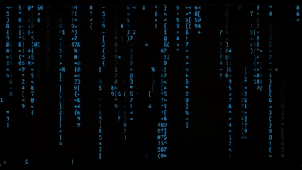

# canimation

A collection of terminal animations including Matrix effects, 3D wireframes, Conway's Game of Life, DVD screensaver, fireworks, and more!

## Usage Examples

### PowerShell
```powershell
# Run Matrix animation
./cmatrix.ps1

# Run at 60 FPS with double speed
./cmatrix.ps1 -Fps 60 -Speed 2

# Random animation with custom settings
./crandom.ps1 -Fps 45 -Speed 1.5

# List available animations
./crandom.ps1 -List
```

### Shell
```bash
# Run Matrix animation
./cmatrix.sh

# With custom settings
./cmatrix.sh --fps 60 --speed 3 --letters --white-leader
```

## Animation Gallery

| Matrix | Matrix Theme (Ice) | Donut |
|--------|-------------------|-------|
|  |  |  |

| DVD Screensaver | Fireworks | Trippy Flow |
|----------------|-----------|-------------|
|  |  |  |

| Meteor Shower | Rain | Snow |
|--------------|------|------|
|  |  |  |
