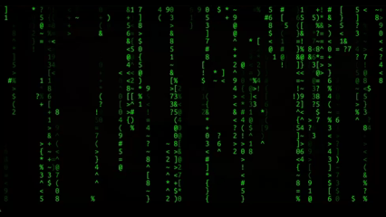

# canimation

A collection of terminal animations including Matrix effects, 3D wireframes, Conway's Game of Life, DVD screensaver, fireworks, and more!

## Installation

### For Windows (PowerShell)
1. Download the latest PowerShell package: [canimation-pwsh.zip](https://github.com/Ddemon26/canimation/releases/latest/download/canimation-pwsh.zip)
2. Extract the zip file to your desired location
3. Open PowerShell and navigate to the extracted directory
4. Run any animation script: `./cmatrix.ps1` or `./crandom.ps1` for a random animation

### For Linux/macOS (Shell)
1. Download the latest Shell package: [canimation-shell.zip](https://github.com/Ddemon26/canimation/releases/latest/download/canimation-shell.zip)
2. Extract the zip file: `unzip canimation-shell.zip`
3. Make scripts executable: `chmod +x shell/*.sh`
4. Run an animation: `./shell/cmatrix.sh`

## Available Animations

**PowerShell Scripts:** Matrix, Donut, DVD screensaver, Fireworks, Flow effects, Meteors, Rain, Snow, Wireframe shapes, Conway's Game of Life, Hearts, Plasma, Starwarp, Text ring, Tunnel, Waves, Boids, Cube, Equalizer, Fireflies, Rain+Snow combo, Smiley faces, and Random picker.

**Shell Scripts:** Matrix effects with customizable options.

## Usage Examples

### PowerShell
```powershell
# Run Matrix animation
./cmatrix.ps1

# Run at 60 FPS with double speed
./cmatrix.ps1 -Fps 60 -Speed 2

# Random animation with custom settings
./crandom.ps1 -Fps 45 -Speed 1.5

# List available animations
./crandom.ps1 -List
```

### Shell
```bash
# Run Matrix animation
./cmatrix.sh

# With custom settings
./cmatrix.sh --fps 60 --speed 3 --letters --white-leader
```

## Animation Gallery

| Matrix | Matrix Theme (Ice) | Donut |
|--------|-------------------|-------|
|  |  |  |

| DVD Screensaver | Fireworks | Trippy Flow |
|----------------|-----------|-------------|
|  |  |  |

| Meteor Shower | Rain | Snow |
|--------------|------|------|
|  |  |  |
